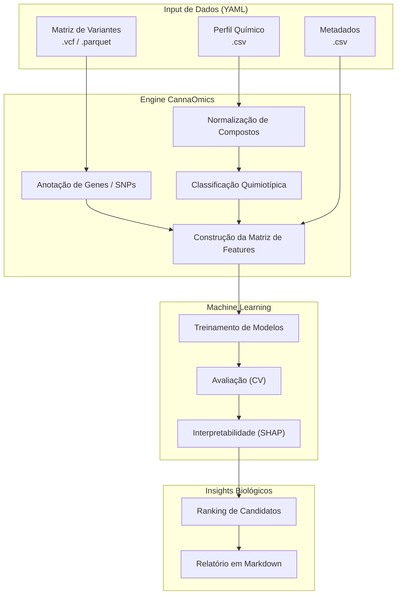

<div align="center">

# 🧬 CannaOmics AI

### Do genoma ao quimiotipo, com método, código e evidência.

[](#-status-do-projeto)
[](CHANGELOG.md)
[](LICENSE)
[](https://python.org)
[](https://github.com/astral-sh/ruff)
[](tests/)

**Framework open-source de bioinformática e *machine learning* interpretável dedicado à *Cannabis sativa*. O CannaOmics AI integra dados genômicos, transcriptômicos e perfis químicos para reproduzir achados publicados e gerar hipóteses testáveis sobre genes, variantes e padrões associados à produção de terpenos e canabinoides — com IA que explica por que apostou em cada candidato.**

[Por que existe](#-por-que-o-cannaomics-ai-existe) · [O que faz hoje](#-o-que-ele-faz-hoje) · [Quick Start](#-quick-start) · [Arquitetura](#-arquitetura) · [Roadmap](#-roadmap-de-desenvolvimento) · [Status](#-status-do-projeto)

</div>

---

## 🌿 Por Que o CannaOmics AI Existe?

A pesquisa sobre a genética da *Cannabis* sofre historicamente com **dados fragmentados, pipelines não padronizados e estudos difíceis de reproduzir**. Publicações independentes mapeiam variantes ligadas a terpenos (como na família *CsTPS*) ou a canabinoides (*THCAS*, *CBDAS*, *CBCAS*), mas transformar essas descobertas em **código reutilizável**, datasets padronizados e modelos preditivos auditáveis ainda é um gargalo enorme.

O **CannaOmics AI** preenche esse vácuo. Não é uma caixa-preta: é um ecossistema transparente que transforma intuição biológica em pipelines reproduzíveis, modelos matemáticos interpretáveis e relatórios científicos defensáveis.

> *"From genome to chemotype, reproducibly."*

## ⚡ O Que Ele Faz Hoje

O esqueleto MVP roda end-to-end via `cannaomics demo` em poucos segundos. Já entregue na versão `0.1.0`:

- ⚗️ **Normalização química** — dicionário de sinônimos com tradução automática de letras gregas (`β-myrcene` ⇄ `beta_myrcene`, `Δ⁹-THC` ⇄ `THC`) e classificação de quimiotipo (`THC-dominant`, `CBD-dominant`, `Balanced`, `Other`) configurável.
- 🧬 **Catálogo curado de genes** — 22 genes-chave de *Cannabis sativa* já registrados: família *CsTPS* (terpene synthases), *THCAS*/*CBDAS*/*CBCAS* (cannabinoid synthases), *OAC*, prenyltransferases, e vias precursoras MEP/MEV (*DXS*, *DXR*, *HMGR*, *IDI*, *GPPS*, *FPPS*…).
- 🧠 **Registry de modelos ML** — Dummy baseline, Logistic Regression, Random Forest (testado no demo), Elastic Net e XGBoost (opcional via `[ml]`). Cross-validation estratificado k-fold com métricas balanceadas (accuracy, balanced-accuracy, F1, ROC-AUC).
- 🔬 **Interpretabilidade** — permutation importance + SHAP (TreeExplainer / LinearExplainer / fallback genérico) com fallback silencioso quando a lib não está instalada. Ranking de candidatos com anotação biológica vinda do gene catalog.
- 📊 **Relatório Markdown** — template Jinja2 (com whitespace control) que renderiza tabela de métricas e top-N candidatos. HTML interativo de feature importance via Plotly.
- ⚙️ **Configuração YAML validada** — schema Pydantic v2 com seções tipadas para projeto, dados, alvo, features, modelo, validação, interpretabilidade e relatório.
- 🪟 **Cross-platform de verdade** — Windows (com *console hardening* UTF-8 + Rich sem legacy renderer), macOS e Linux. Sem `UnicodeEncodeError` no `--help`.
- ✅ **Higiene de código** — `ruff check` com 0 erros, `pytest` 8/8 passando, type hints completos em módulos core, Pydantic v2 nas configs, *reproducibility manifest* preparado.

### 🛠️ Em Desenvolvimento Ativo (Fases 1+)

Para definir expectativas com honestidade:

- 🟡 CLI `run` / `train` / `report` (hoje só `demo` faz o pipeline real ponta-a-ponta)
- 🟡 Ingestão nativa de **VCF / GFF / FASTA** via pysam / biopython / gffutils (hoje aceita CSV/Parquet pré-processado)
- 🟡 Dataset público real (Dryad **Watts 2021**) substituindo o sintético
- 🟡 Relatórios HTML completos com gráficos Plotly embarcados
- 🟡 Site de documentação `mkdocs-material` com background científico, glossário e *model cards*
- 🟡 8 notebooks didáticos cobrindo o pipeline completo
- 🟡 CI/CD GitHub Actions (tests, lint, docs)

Acompanhe o progresso real no [`ROADMAP.md`](ROADMAP.md) e no [`CHANGELOG.md`](CHANGELOG.md).

### 🚫 O Que Ele NÃO Faz (e nunca fará)

- ❌ **Não dá orientação de cultivo, rendimento ou otimização agronômica.**
- ❌ **Não emite alegações médicas ou terapêuticas** — não é dispositivo médico.
- ❌ **Não analisa dados humanos** nem perfis de pacientes.
- ❌ **Não otimiza produção de substâncias controladas** nem facilita uso ilegal.
- ❌ **Não substitui validação laboratorial** — gera *hipóteses computacionais*, não causalidade.

Resultados são interpretados como **geração de hipóteses para futura validação experimental**, e não como prova causal. Veja [`CODE_OF_CONDUCT.md`](CODE_OF_CONDUCT.md) e [`CONTRIBUTING.md`](CONTRIBUTING.md) para detalhes éticos e regulatórios.

---

## 🚀 Quick Start

### 1. Instalação

O framework exige **Python 3.11+** (testado em 3.11, 3.12 e 3.13).

```bash
# Clone o repositório
git clone https://github.com/caramaschiHG/CannaOmics-ai.git
cd CannaOmics-ai

# Instale o pacote em modo editável + extras de ML e plotting
pip install -e ".[ml,plotting]"
```

> **Nota para parsing genômico nativo:** para pipelines que vão depender de `pysam`, `gffutils` ou `scikit-allel` quando forem implementados (Fase 2+), use `pip install -e ".[all]"` preferencialmente em Linux/WSL. Em Windows puro, `pysam` historicamente exige WSL.

### 2. Valide a instalação

```bash
ruff check cannaomics/ tests/   # esperado: "All checks passed!"
pytest tests/                   # esperado: "8 passed"
cannaomics --version            # esperado: "CannaOmics AI  v0.1.0"
```

### 3. Rode a pipeline de demonstração

```bash
cannaomics demo
```

A CLI carrega dados sintéticos pré-empacotados (20 amostras × 5 SNPs vs 5 compostos), classifica quimiotipos via razão THC/CBD, alinha matriz de variantes com matriz química, treina um *Random Forest* com 3-fold CV, computa *permutation importance* e *SHAP values*, ranqueia candidatos com contexto biológico do gene catalog, e ejeta o relatório em `results/demo_run/report_demo_001.md`. Tudo em poucos segundos.

> **⚠️ Honestidade científica sobre o demo:** o dataset sintético é intencionalmente **determinístico** — os SNPs preditores codificam diretamente a label de quimiotipo, então o modelo atinge 100% de accuracy. Isso valida o pipeline ponta-a-ponta, **não simula performance real**. A integração com datasets públicos reais (Dryad *Watts 2021*) e dataset sintético com ruído controlado entram nas Fases 1-2 do roadmap.

---

## 🔬 Escopo Científico

O CannaOmics AI foca na elucidação dos determinantes genéticos de dois grandes grupos metabólicos:

| 🌸 **Terpenos Alvo** | 🌿 **Canabinoides Alvo** | 🧬 **Famílias Gênicas Base** |
|:---|:---|:---|
| β-mirceno | THC / THCA | *CsTPS* (Terpeno Sintases) |
| Limoneno | CBD / CBDA | *OAC* (Ácido Olivetólico Ciclase) |
| α/β-pineno | CBC / CBCA | *THCAS* (THCA Sintase) |
| β-cariofileno | CBG / CBGA | *CBDAS* (CBDA Sintase) |
| Terpinoleno | THCV / CBDV | Vias MEP / MEV (*DXS, HMGR*) |

---

## 🏗️ Arquitetura

O coração do pipeline flui através de uma arquitetura limpa de processamento de dados biológicos.



---

## 🗺️ Roadmap de Desenvolvimento

A expansão do CannaOmics AI segue fases modulares para garantir integridade científica. Veja [`ROADMAP.md`](ROADMAP.md) para o detalhe canônico.

| Fase | Título | Status | Objetivo Principal |
|:---:|:---|:---:|:---|
| **0** | **Repo Setup** | ✅ | Fundação, documentação, CI/CD, scaffold do projeto. |
| **1** | **Dataset & Baseline MVP** | 🔄 | Mini-dataset sintético, normalização química, modelos baseline e geração automática de relatório (`cannaomics demo`). |
| **2** | **Public Data Integration** | ⬜ | Ingestão de dados públicos reais (e.g. Dryad *Watts 2021*) e construção das matrizes de features de verdade. |
| **3** | **Terpene Synthase (TPS) Focus** | ⬜ | Tabela curada de genes CsTPS, mapeamento variant→gene window, modelo focado em alvos terpênicos. |
| **4** | **Cannabinoid Pathway Focus** | ⬜ | Mapeamento THCAS/CBDAS/CBCAS, classificação de quimiotipo (THC/CBD dominante). |
| **5** | **Deep Interpretability** | ⬜ | Permutation importance, SHAP e engine de ranking de candidatos. |
| **6** | **Public Demo & Polish** | ⬜ | Relatórios visuais aprimorados, experiência de CLI polida, dependências otimizadas. |
| **7** | **Preprint / Technical Report** | ⬜ | Publicação da metodologia e dos achados iniciais do baseline. |

---

## 📍 Status do Projeto

**Versão atual:** `0.1.0` — *alpha MVP* (Fase 0 completa, Fase 1 em andamento)

| Aspecto | Estado | Detalhes |
|---|:---:|---|
| **Instalação editável** | ✅ | `pip install -e ".[ml,plotting]"` em Python 3.11 / 3.12 / 3.13 |
| **Lint (`ruff`)** | ✅ | 0 erros — `ruff check cannaomics/ tests/` passa limpo |
| **Testes (`pytest`)** | ✅ | 8/8 passando — `chemistry`, `genomics`, `pipeline` |
| **CLI cross-platform** | ✅ | `--help`, `--version` e `demo` funcionando em Windows / macOS / Linux |
| **Demo end-to-end** | ✅ | `cannaomics demo` gera relatório Markdown + modelo joblib + plots |
| **CLI `run` / `train` / `report`** | 🟡 | Stubs implementados; pipeline completo via config YAML na Fase 1 |
| **Datasets reais** | ⬜ | Hoje só sintético; integração Dryad na Fase 2 |
| **Parsing VCF / GFF / FASTA nativo** | ⬜ | Hoje aceita CSV/Parquet; nativo na Fase 2-3 |
| **Site de documentação** | ⬜ | README + CONTRIBUTING + ROADMAP por enquanto; `mkdocs` no roadmap |
| **CI/CD (GitHub Actions)** | ⬜ | Em design — workflows de tests, lint e docs |

Para um relato completo do que mudou em cada versão, veja [`CHANGELOG.md`](CHANGELOG.md). Para o plano detalhado das próximas fases, veja [`ROADMAP.md`](ROADMAP.md).

---

## 🤝 Contribuindo

Contribuições são **muito bem-vindas** — especialmente nas frentes científica e de engenharia:

- 🧬 **Curar genes adicionais** para o catalog (com referências publicadas)
- ⚗️ **Expandir o dicionário de sinônimos** de compostos químicos
- 🧪 **Adicionar suporte a novos datasets** públicos
- 🔬 **Propor métodos de interpretabilidade** ou *candidate ranking*
- 🐛 **Reportar bugs** ou propor *features*

Antes de abrir um PR, leia [`CONTRIBUTING.md`](CONTRIBUTING.md) — temos padrões claros de código (ruff + numpy docstring + Pydantic v2), workflow de testes, e um escopo bem definido do que aceitamos (e do que está fora de escopo: cultivo, dosagem, alegações médicas).

---

## 🌟 Créditos & Visão

Este projeto nasceu de uma intuição científica simples e poderosa:

> *Se a literatura científica já consegue identificar marcadores genéticos atrelados a perfis químicos complexos, podemos transformar esses métodos em software open-source hiper-reproduzível e usar IA interpretável para revelar padrões escondidos — sem virar caixa-preta.*

- 💡 **Faísca conceitual:** Leon
- 🛠️ **Arquitetura de IA, pipeline de bioinformática & desenvolvimento open-source:** Sylvian Caramaschi

Citação acadêmica disponível em [`CITATION.cff`](CITATION.cff) (formato CFF 1.2.0).

---

<div align="center">

*"CannaOmics AI não é uma caixa-preta. É um instrumento de iluminação<br>sobre a relação entre genótipo e quimiotipo."*

**[Apache License 2.0](LICENSE)** &nbsp;·&nbsp; Copyright © 2026 Sylvian Caramaschi

</div>
