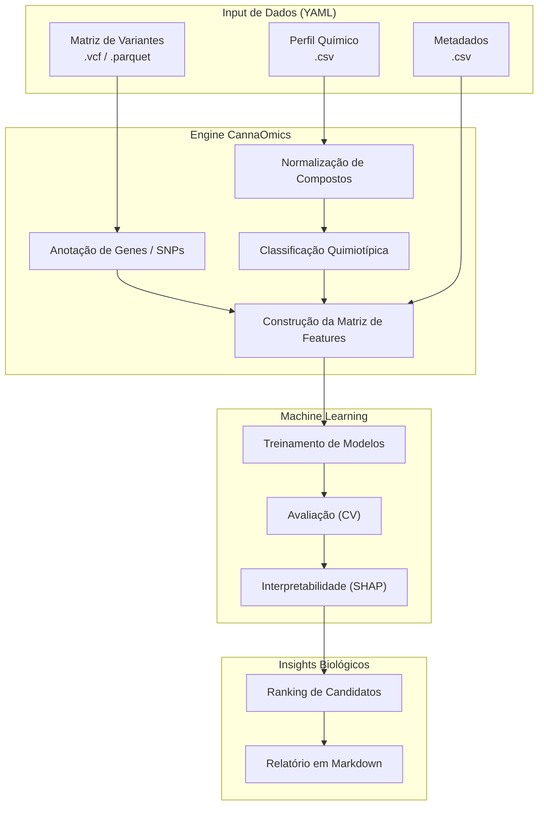

<div align="center">

# 🧬 CannaOmics AI

### Do genoma ao quimiotipo, com método, código e evidência.

[](https://opensource.org/licenses/Apache-2.0)
[](https://python.org)
[](https://github.com/caramaschiHG/CannaOmics-ai/actions)
[](https://github.com/astral-sh/ruff)

**Um framework open-source de bioinformática e inteligência artificial dedicado à decodificação da *Cannabis sativa*. O CannaOmics AI integra dados genômicos, transcriptômicos e perfis químicos complexos para reproduzir pesquisas de ponta e gerar novas hipóteses testáveis sobre vias metabólicas, genes e a produção de terpenos e canabinoides.**

[O Problema](#-por-que-o-cannaomics-ai-existe) · [Capacidades](#-o-que-ele-faz) · [Quick Start](#-quick-start) · [Arquitetura](#-arquitetura) · [Roadmap](#-roadmap)

</div>

---

## 🌿 Por Que o CannaOmics AI Existe?

A pesquisa sobre a genética da *Cannabis* sofre historicamente com dados fragmentados, pipelines não padronizados e estudos difíceis de reproduzir. Pesquisadores isolam variantes ligadas a terpenos em publicações independentes (como no mapeamento de *CsTPS*), mas transformar essas descobertas em **código reutilizável** e modelos preditivos em larga escala tem sido um gargalo.

O **CannaOmics AI** preenche esse vácuo. Não somos uma caixa-preta; somos um ecossistema transparente que transforma a intuição biológica em modelos matemáticos e de *machine learning* reprodutíveis.

## ⚡ O Que Ele Faz

- 🧬 **Mapeamento de Variantes**: Alinha SNPs e InDels de genomas inteiros (*WGS*) em torno de famílias gênicas chave.
- ⚗️ **Análise Quimiotípica**: Processa perfis complexos de metabólitos secundários e padroniza quimiotipos.
- 🧠 **Machine Learning**: Treina modelos (Random Forest, XGBoost, Elastic Net) para prever a presença de canabinoides e terpenos baseando-se estritamente na assinatura genômica.
- 🔬 **Interpretabilidade Biológica**: Utiliza valores de SHAP e Permutation Importance para ranquear variantes candidatas, ligando o peso do algoritmo de volta ao contexto biológico (ex: regiões promotoras do *THCAS*).
- 📊 **Geração de Relatórios Automáticos**: Compila os achados em relatórios Markdown/HTML ricos e reprodutíveis.
- 🧪 **Pipelines Customizáveis**: Configuração baseada puramente em arquivos YAML, sem hardcoding.

### 🚫 O Que Ele NÃO Faz
- Não analisa dados humanos nem perfis de pacientes.
- Não faz cruzamentos agronômicos práticos nem gerencia estufas.
- Não emite alegações médicas ou terapêuticas.
- Não apoia nem facilita qualquer violação da legislação local sobre *Cannabis*.

---

## 🚀 Quick Start

### 1. Instalação

O framework exige o **Python 3.11+**.

```bash
# Clone o repositório
git clone https://github.com/caramaschiHG/CannaOmics-ai.git
cd CannaOmics-ai

# Instale o core package e dependências de Data Science
pip install -e ".[ml,plotting]"
```

> **Nota para Bioinformática:** Se for rodar a pipeline pesada de genômica que depende de VCFs/BAMs nativos (ex: `pysam`), recomendamos instalar a flag completa `pip install -e ".[all]"` utilizando um ambiente Linux ou WSL.

### 2. Rodando a Pipeline de Demonstração

Quer ver a mágica acontecendo na sua máquina em menos de 10 segundos? Execute nosso comando de demonstração com dados sintéticos:

```bash
cannaomics demo
```
**O que vai acontecer?** A CLI irá instanciar variantes genéticas simuladas (como SNPs próximos a *CsTPS1* e *THCAS*), processar as quantificações químicas, treinar um modelo de *Random Forest*, interpretar as predições via SHAP e ejetar um relatório impecável no diretório `results/demo_run/`.

---

## 🔬 Escopo Científico

O CannaOmics AI foca na elucidação dos determinantes genéticos de dois grandes grupos metabólicos:

| 🌸 **Terpenos Alvo** | 🌿 **Canabinoides Alvo** | 🧬 **Famílias Gênicas Base** |
|:---|:---|:---|
| β-mirceno | THC / THCA | *CsTPS* (Terpeno Sintases) |
| Limoneno | CBD / CBDA | *OAC* (Ácido Olivetólico Ciclase) |
| α/β-pineno | CBC / CBCA | *THCAS* (THCA Sintase) |
| β-cariofileno | CBG / CBGA | *CBDAS* (CBDA Sintase) |
| Terpinoleno | THCV / CBDV | Vias MEP / MEV (*DXS, HMGR*) |

---

## 🏗️ Arquitetura

O coração do pipeline flui através de uma arquitetura limpa de processamento de dados biológicos.



---

## 🗺️ Roadmap de Desenvolvimento

A expansão do CannaOmics AI segue fases modulares para garantir integridade científica. Veja [`ROADMAP.md`](ROADMAP.md) para o detalhe canônico.

| Fase | Título | Status | Objetivo Principal |
|:---:|:---|:---:|:---|
| **0** | **Repo Setup** | ✅ | Fundação, documentação, CI/CD, scaffold do projeto. |
| **1** | **Dataset & Baseline MVP** | 🔄 | Mini-dataset sintético, normalização química, modelos baseline e geração automática de relatório (`cannaomics demo`). |
| **2** | **Public Data Integration** | ⬜ | Ingestão de dados públicos reais (e.g. Dryad *Watts 2021*) e construção das matrizes de features de verdade. |
| **3** | **Terpene Synthase (TPS) Focus** | ⬜ | Tabela curada de genes CsTPS, mapeamento variant→gene window, modelo focado em alvos terpênicos. |
| **4** | **Cannabinoid Pathway Focus** | ⬜ | Mapeamento THCAS/CBDAS/CBCAS, classificação de quimiotipo (THC/CBD dominante). |
| **5** | **Deep Interpretability** | ⬜ | Permutation importance, SHAP e engine de ranking de candidatos. |
| **6** | **Public Demo & Polish** | ⬜ | Relatórios visuais aprimorados, experiência de CLI polida, dependências otimizadas. |
| **7** | **Preprint / Technical Report** | ⬜ | Publicação da metodologia e dos achados iniciais do baseline. |

---

## 🤝 Créditos & Visão

Este projeto nasceu de uma forte intuição científica:
> *Se a literatura científica atual consegue identificar marcadores genéticos atrelados a perfis químicos complexos, nós podemos transformar esses métodos em software open-source hiper-reprodutível e usar IA para revelar os padrões escondidos.*

- **Faísca conceitual:** Leon 
- **Arquitetura de IA, Pipeline de Bioinformática & Desenvolvimento Open-source:** Sylvian Caramaschi

---

<div align="center">
<i>"CannaOmics AI não é uma caixa-preta. É um instrumento de iluminação sobre a relação entre genótipo e quimiotipo."</i><br><br>
<b><a href="LICENSE">Apache License 2.0</a></b> | Copyright 2026 Sylvian Caramaschi
</div>
